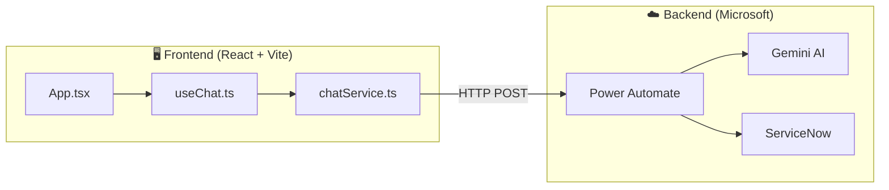
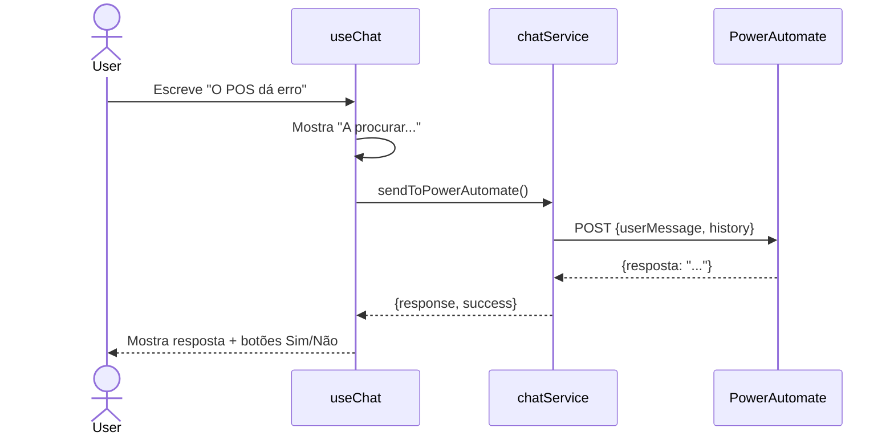

# Winprovit Support AI — Documentação Técnica

> Chatbot de Suporte Técnico que comunica com Power Automate

---

## 1. Arquitetura



**Princípio**: O frontend é apenas uma UI de chat. Toda a lógica de IA e integração está no Power Automate.

---

## 2. Estrutura de Pastas

```
winprovit-support-ai/
├── App.tsx                 # Componente principal
├── index.tsx               # Entry point
├── index.html              # HTML + Tailwind config
├── types.ts                # Tipos TypeScript
├── vite.config.ts          # Config Vite
│
├── components/
│   ├── ChatHeader.tsx      # Cabeçalho com logo
│   ├── ChatInput.tsx       # Input + botão enviar
│   ├── MessageBubble.tsx   # Bolha de mensagem
│   └── Logo.tsx            # Logo Winprovit
│
├── hooks/
│   └── useChat.ts          # Estado e lógica do chat
│
├── services/
│   └── chatService.ts      # Comunicação com Power Automate
│
└── public/
    ├── manifest.json       # PWA
    └── sw.js               # Service Worker
```

---

## 3. Ficheiros Principais

### 3.1. `App.tsx`

Componente raiz que compõe a interface:

```tsx
export default function App() {
  const { messages, input, ... } = useChat();
  
  return (
    <div>
      <ChatHeader />
      <main>{messages.map(m => <MessageBubble ... />)}</main>
      <ChatInput ... />
    </div>
  );
}
```

### 3.2. `useChat.ts`

Custom hook com toda a lógica de estado:

| Estado | Tipo | Descrição |
|--------|------|-----------|
| `messages` | `Message[]` | Histórico de mensagens |
| `input` | `string` | Texto atual |
| `isLoading` | `boolean` | A processar? |
| `selectedImage` | `{url, file}` | Imagem anexada |
| `failedAttempts` | `number` | Tentativas falhadas (0-3) |
| `pendingEscalation` | `object` | Dados para ticket |

### 3.3. `chatService.ts`

Serviço de comunicação com Power Automate:

| Função | Descrição |
|--------|-----------|
| `sendToPowerAutomate()` | Envia mensagem do utilizador |
| `createServiceNowTicket()` | Cria ticket de escalação |
| `sendFeedback()` | Envia feedback (sim/não) |

---

## 4. Fluxo de Mensagem



---

## 5. Sistema de Retry

```
Utilizador clica "Não ajudou"
    └── failedAttempts < 3?
        ├── SIM → Envia retry ao Power Automate
        └── NÃO → Escala para ServiceNow
            └── Power Automate cria ticket
```

---

## 6. Variáveis de Ambiente

```bash
# .env.local
VITE_POWER_AUTOMATE_URL=https://...      # Webhook principal
VITE_POWER_AUTOMATE_ESCALATION_URL=...   # Webhook para tickets
```

---

## 7. Tipos (`types.ts`)

```typescript
export enum Role {
  USER = 'user',
  MODEL = 'model'
}

export interface Message {
  id: string;
  role: Role;
  text: string;
  image?: string;
  timestamp: Date;
  hasFeedback?: boolean;
  feedbackGiven?: 'yes' | 'no';
  isStatusMessage?: boolean;
  statusType?: 'loading' | 'success' | 'error' | 'warning' | 'info';
}
```

---

## 8. Componentes Visuais

| Componente | Função |
|------------|--------|
| `ChatHeader` | Logo + título fixo no topo |
| `ChatInput` | Textarea + anexar imagem + enviar |
| `MessageBubble` | Bolha estilizada com feedback |

---

## 9. Tecnologias

| Categoria | Tecnologia |
|-----------|------------|
| **Frontend** | React 19, TypeScript, Vite |
| **Styling** | Tailwind CSS (CDN) |
| **Icons** | Lucide React |
| **Backend** | Power Automate |
| **PWA** | Service Worker |
