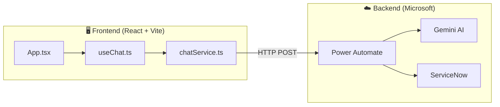

# Arquitetura

## Diagrama Geral

## Princípio

O frontend é apenas uma UI de chat. Toda a lógica de IA e integração está no **Power Automate**.

## Fluxo de Dados

1. **Utilizador** escreve mensagem na UI
2. **useChat.ts** gere o estado e chama o serviço
3. **chatService.ts** envia HTTP POST ao Power Automate
4. **Power Automate** processa com Gemini AI
5. **Resposta** retorna ao frontend
6. Se necessário, **ServiceNow** cria ticket de escalação
