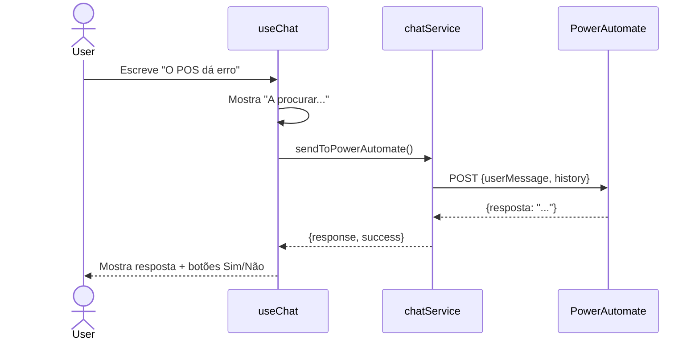

# Fluxo de Mensagem

## Diagrama de Sequência



---

## Sistema de Retry

```
Utilizador clica "Não ajudou"
    └── failedAttempts < 3?
        ├── SIM → Envia retry ao Power Automate
        └── NÃO → Escala para ServiceNow
            └── Power Automate cria ticket
```

### Lógica de Escalação

1. Utilizador recebe resposta
2. Clica "Não ajudou"
3. `failedAttempts` incrementa
4. Se `failedAttempts >= 3`:
   - Mostra formulário de escalação
   - Utilizador preenche dados (loja, POS, descrição)
   - Power Automate cria ticket no ServiceNow
5. Se `failedAttempts < 3`:
   - Nova tentativa com contexto adicional
